# NFSensor API Reference


## Introduction


The NFSensor API includes a  programming library that allow you to write custom programs to integrate with the different Sensors distributed  by NanoFocus AG. This reference guide contains information on this library and is directed toward programmers using C languages or C++ (using the C library), who want to write their own sensor control applications for a particular sensor. For languages like C# or Python, language bindings are provided, which will be refered in supplementary documentation.


## Requirements

* Operating System Windows 10 64Bit
* ANSI C99  compliant compiler
* Tested and developed under Visual Studio 2017 Professional
* All strings handled here are zero – terminated plain ASCII strings (not unicode).


## Dependencies and Distribution

NFEval Sensor API ships as a self contained zip archive and contains all binaries to operate on a specified sensor. A dependency graph can be seen in Fig. "Package Dependency". Dependend on current version, the filenames can be differ by version postfixes. In addition the package contains neccessary third party libraries as needed.



Fig: Package Dependency


## Overview

### Plugin System

All sensor specific implementation are sourced out to a specific plugin dll which is usually located in the devices sub folder.

### Statemachine

The NFSensor API is based on a finite state machine implementation. See Fig. "State Machine Architecture" for an overview. At any given point in time the system is in a requested state or state transition and the state can be queried at any given point in time.



Fig: State Machine Architecture

The design implies that called forbidden state transition could not be possible. For example, it is not adviseable to go from state NFSensor_Acquisition to NFSensor_Live which would result in unpredicted data. Therefore the internal design prohibits such transitions and will return an error to the caller.
All states are mapped to  state ID as shown in Table 1.
```cpp
typedef enum
  {
    Unkown = 0,
    Error,
    Connecting,
    Connected,
    Initializing,
    Idle,
    Calibrating,
    Live,
    Acquisition,
    PreparingAcquisition,
    AcquiringData,
    PostProcessingAcquisition,
    IdleReady,
    IdleWithErrors,
    IdleAborted
  } StateID;
  ```
Table 1: Overview StateID

The current state can be checked with the interface function

_NFSensor_API int NFSensor_GetStateID(SensorHandle hSensor, StateID * eStateID)_

and to use  the result StateID  into  program execution flow.

### Error Handling

In general all interface functions return integer based error code. A non zero return indicates an error. Special error codes are not provided. To obtain further information in plain text you can call the API funtion

_NFSensor_API const char * NFSensor_GetLastError()_

and evaluate the null terminated ASCII string for further error tracing and debugging. Please contact your technical manual and/or service support.


##  Interface functions 

### __Creational Functions__

---
>### NFSensor_API int NFSensor_Create(SensorModel eSensorModel, SensorHandle *hSensor);
---

Purpose:
* selects the specified sensor model specified by eSensorModel
* creates all of internal machinery and dependencies. Loads additional plugins if needed
* has to be called  at least once
* multiple creations of the same physical sensor is prevented by the library and returns non zero return and a null SensorHandle
* accidently creation of an already created sensor device returns non zero, but the handle is still valid

Parameters:

* eSensorModel [in]: selected Sensor Id, from available Sensor Models
* hSensor [out]: opaque identifier to sensor object, aka sensor handle

Returns:

* Zero on success

Example usage:


---
>### NFSensor_API int NFSensor_Destroy(SensorHandle hSensor);
 ---

Purpose:
* cleans up all of internal machinery and dependencies
* should be called at end of usage / end of program flow or if sensor has to be recreated by any reason

Parameters:

* hSensor  [in]: current sensor handle

Returns:

* Zero on success

Example usage:


### __State Transition Functions__

---
>###  NFSensor_API int NFSensor_Connect(SensorHandle hSensor);
---

Purpose:
* establishes the connection to the underlying sensor device hardware
* triggers state transition from Unknown to Connected
* on non zero success, the last error can be obtained with NFSensor_GetLastError

Parameters: 

* hSensor  [in]: current sensor handle

Returns:

* Zero on success
* on non zero success, the last error can be obtained with _NFSensor_GetLastError_ 

Example usage:


---
>###  NFSensor_API int NFSensor_Init(SensorHandle hSensor);
---

Purpose:
* prepares / initializes for subsequent operations
* triggers state transition from Connected to Idle
* on non zero success, the last error can be obtained with _NFSensor_GetLastError_  

Parameters:

* hSensor  [in]: current sensor handle

Returns:

* Zero on success
* on non zero success, the last error can be obtained with _NFSensor_GetLastError_ 

Example usage:


---
>###  NFSensor_API int NFSensor_ShutDown(SensorHandle hSensor);
---

Purpose:

* triggers state transition from Idle to Connected
* on non zero success, the last error can be obtained with _NFSensor_GetLastError_

Parameters:

* hSensor  [in]: current sensor handle

Returns:

* Zero on success
* on non zero success, the last error can be obtained with _NFSensor_GetLastError_

Example usage:


---
>###  NFSensor_API int NFSensor_Disconnect(SensorHandle hSensor);
---

Purpose:
* cleans up and closes resources to underlying sensor device hardware
* triggers state transition from Connected to Unknown
* on non zero success, the last error can be obtained with _NFSensor_GetLastError_

Parameters: 

* hSensor  [in]: current sensor handle

Returns:

* Zero on success
* on non zero success, the last error can be obtained with _NFSensor_GetLastError_

Example usage:


### __State synchronization  Functions__

To ensure correct program  flow often it is necessary and recommended to  check and syncronize for  states. NFSensor API  provides  different function calls to query 
states.

---
>### NFSensor_API int NFSensor_GetStateID(SensorHandle hSensor, StateID * eStateID);
---

Purpose:
* yields current eStateID as defined  in corresponding enum StateID
* 
 

Parameters: 

* hSensor  [in]: current sensor handle
* eStateID [out]: state Id  to  query for
 

Returns:

* Zero on success
* on non zero success, the last error can be obtained with _NFSensor_GetLastError_

Example usage:


---
>### NFSensor_API int NFSensor_IsInState(SensorHandle hSensor, StateID eStateID, bool * bInStateID);
---
Purpose:
*  
 

Parameters: 

* hSensor  [in]: current sensor handle
* eStateID [in]: state Id  to  query for
* bInStateID [out]:  result  of query

Returns:

* Zero on success
* on non zero success, the last error can be obtained with _NFSensor_GetLastError_

Example usage:

---
>### NFSensor_API int NFSensor_IsAcquiring(SensorHandle hSensor, bool * bAcquiring);
---

Purpose:
*  convenience function to test  for the outer  state Acquisition 

Parameters: 

* hSensor  [in]: current sensor handle
* bAcquiring [out]:  result  of query


Returns:

* Zero on success
* on non zero success, the last error can be obtained with _NFSensor_GetLastError_

Example usage:

---
>###  NFSensor_API int NFSensor_IsLive(SensorHandle hSensor, bool * bLive);
---

Purpose:
* convenience function to test for outer state Live 
 

Parameters: 

* hSensor  [in]: current sensor handle
* bLive [out]:  result  of query


Returns:

* Zero on success
* on non zero success, the last error can be obtained with _NFSensor_GetLastError_

Example usage:


### __Acquisition Functions__ 

---
>###  NFSensor_API int NFSensor_StartLive(SensorHandle hSensor);
---

Purpose:
 * triggers state transition from Idle to Live
 * sensor continously acquires data buffers and calls the user provided callback LiveDataReadyCallback
 * used to show signal during setup and testing

Parameters:

* hSensor  [in]: current sensor handle

Returns:

* Zero on success
 
Example usage:


---
>### NFSensor_API int NFSensor_StopLive(SensorHandle hSensor);
---

Purpose:
 * quits the live state operation
 * triggers state transition from Live to Idle
 * has to be called before data acquisition

Parameters:

* hSensor  [in]: current sensor handle
 
Returns:

* Zero on success

Example usage:


---
>###  NFSensor_API int NFSensor_StartAcquisition(SensorHandle hSensor, uint64_t NumberOfBuffers);
---

Purpose:
* triggers state transition from Idle to Acquisition
* function returns immediately
* finish of acquisition is signaled by _AcquisitionDoneCallback_

Parameters:

* hSensor  [in]: current sensor handle
* NumberOfBuffers [in]: number of data points (buffers) to acquire

Returns:

* Zero on success

Example usage:


---
>###  NFSensor_API int NFSensor_StopAcquisition(SensorHandle hSensor);
---

Purpose:
* triggers state transition from Acquisition to Idle
* with this function user can cancel current acquisition phase
* function returns immediately, due to internal processing a synchronisation of sensor state is advisable before program flow continuation 

Parameters:

* hSensor  [in]: current sensor handle

Returns:

* Zero on success
* on non zero success, the specified parameter is not available for the current sensor

Example usage:


 
---
>###   NFSensor_API int NFSensor_Acknowledge(SensorHandle hSensor);
---

Purpose:
* in case sensor device is in state IdleAborted or IdleWithErrors, state transition to Idle
* in case sensor device is in state Error, state transition to Unknown

Parameters:

* hSensor  [in]: current sensor handle

Returns:

* Zero on success
 
Example usage:


### __DataHandling / Callback Functions__

* The begin and/or end  of Live state or Acquisition state  is signaled  by calling a user provided callback function. In this case no  data is associated  with the callbacks. 
* while the sensor is in Live or Acquire state the client is notified about  new  data by calling a  user provided  callback function.


### Callback Signatures

```cpp
  typedef void(*NFLiveDataCallback)(TransferData*);
  typedef void(*NFAcqDataCallback)(TransferData*);

  typedef void(*NFLiveStartCallback)(void);
  typedef void(*NFLiveDoneCallback)(void);
  typedef void(*NFAcqStartCallback)(void);
  typedef void(*NFAcqDoneCallback)(void);
```
 
###  Callback Parameters

In case of NFLiveDataCallback and NFAcqDataCallback the associated data  is returned to the caller by parameter struct TransferData:

 >### typedef struct TransferData_t


```cpp 
typedef struct TransferData_t
 {
    int64_t NX;
    int64_t NY;
    int64_t NumberOfBuffers;  
    int64_t numberOfLayers;  
    float* data_height;
    uint16_t maxIntensity;   
    uint16_t* data_intens;
    float* data_height2;
    uint16_t* data_intens2;

} TransferData;
``` 

Purpose: gives the  client access to the data, associated  with live or acquisition state. 


Fields:

* NX  [out]]: number of data points in X Dimension
* NY  [out]: number of data points along sensor line  , e.g.  NY = 128 for C3 sensor type, NY = 256  for C3x sensor type  often this is refered as number of sensor channels
* NumberOfBuffers  [out]: number of atomic data entities, in case of line scan sensors, the number of scan lines recently acquired.
  
  In live mode this value is always  NumberOfBuffers = 1.  
  
  In acquisiton state NumberOfBuffer is equal to    NumberOfBuffers   requested  with  a previously call to  NFSensor_StartAcquistion

* numberOfLayers  [out]: some sensors are capable of providing two or more layers of data, e.g. when measuring transparent layers ( upper height, lower height)    
* data_height  [out]:  pointer to  height data    
* maxIntensity  [out]: scale of intensity data, differente sensors have different A/D convertes. Usually this  value gives   maxIntensity = 255 for 8 Bit resolution or  maxIntensity = 4095 for 12 Bit resolution     
* data_intens  [out]:  pointer to intensity data
* data_height2  [out]: pointer to height data of layer 2 (in case of double layer operation)
* data_intens2  [out]: pointer to intensity data of layer 2 (in case of  double layer operation )

Remarks:
* for point sensors  NX = NY =1  holds 
* for line sensors   NX =1 ,  NY > NX  holds
* for area sensors   NX > 1  , NY > 1  holds
* the memory is allocated  by the library and the data  will overwritten  on each callback.
* care should be taken to copy the data into client space for  further processing if desired


Memory Layout:

The datalayout is ordered sequential in memory:

1. Line Sensor (C3x, C3)
 
 (B0)( (Y0 ... NY-1) ) (B1)( (Y0 ... NY-1) ) ... (NumberOfBuffers-1)((Y0 ... NY-1))
  
2. Point Sensor
   
 (B0)( (Y0) ) (B1)( (Y0) ) ... (NumberOfBuffers-1)((Y0))

### 1. Live State Callbacks

---
>### NFSensor_API int NFSensor_SetLiveStartCallback(SensorHandle hSensor, NFLiveStartCallback cb);
---

Purpose:
*  register callback to implementation
*  callback function cb is called  when entering live state

Parameters:

* hSensor  [in]: current sensor handle
* cb  [in]: user defined callback function      
   
Returns:

* Zero on success
 
Example usage:

---
 >### NFSensor_API int NFSensor_SetLiveDataReadyCallback(SensorHandle hSensor, NFLiveDataCallback cb); 
---

Purpose:
*  register callback to implementation 
*  callback function cb is called periodically on arrival of new data if sensor is in Live State
 

Parameters:

* hSensor  [in]: current sensor handle
* cb  [in]: user defined callback function     
Returns:

* Zero on success
 
Example usage:

---
 >### NFSensor_API int NFSensor_SetLiveDoneCallback(SensorHandle hSensor, NFLiveDoneCallback cb);
---

Purpose:
*  register callback to implementation
*  callback function cb is called  when leaving live state
 

Parameters:

* hSensor  [in]: current sensor handle
* cb  [in]: user defined callback function     
Returns:

* Zero on success
 
Example usage:

 ### 2. Acquire State Callback

---
 >### NFSensor_API int NFSensor_SetAcquisitionStartCallback(SensorHandle hSensor, NFAcqStartCallback cb);
 ---

 Purpose:
*  register callback to implementation
*  callback function cb is called  when entering acq state

Parameters:

* hSensor  [in]: current sensor handle
* cb  [in]: user defined callback function     
Returns:

* Zero on success
 
Example usage:

---
 >### NFSensor_API int NFSensor_SetAcquisitionDataReadyCallback(SensorHandle hSensor, NFAcqDataCallback cb);
---

Purpose:
*  register callback to implementation
  

Parameters:

* hSensor  [in]: current sensor handle
* cb  [in]: user defined callback function   
 
Returns:

* Zero on success
 
Example usage:

---
 >### NFSensor_API int NFSensor_SetAcquisitionDoneCallback(SensorHandle hSensor, NFAcqDoneCallback cb);
---

Purpose:
* register callback to implementation
* callback function cb is called  when leaving acq state

Parameters:

* hSensor  [in]: current sensor handle
* cb  [in]: user defined callback function   


Returns:

* Zero on success
 
Example usage:  


### __Configuration Functions__

To reflect on  each sensor specific parameters the NFSensor API provides a generic like interface to get and set parameters. It is organized by key - value semantic and the ParamType data structure allows to pass floating point values, integer values or string values by specifiying the apropiate data type.
The get and set functions are not bound to state machine states, so it is possible to use them at any point in the program flow. It can be 
necessary for example to set certain connection parameters (e.g. IP Address ) before calling NFSensor_Connect to transit into the idle state. Though there are common parameters for all sensors, the available parameter keys are stored in a specific header file for each sensor 
shipped with the library.

---
>### NFSensor_API int NFSensor_GetParameter(SensorHandle hSensor, const char * strParamName, ParamType * sParamValue);
---

Purpose:
 * retrieve sensor parameter by given key strParamName

Parameters:

* hSensor  [in]: current sensor handle
* const char * strParamName [in]: parameter name , zero terminated ASCII string 
* ParamType * sParamValue [out]: parameter value

Returns:

* Zero on success
* on non zero success, the specified parameter is not available for the current sensor

Example usage:

```cpp
#include "NFScanSensorSimulParameter.h"

SensorHandle hSensor = 0;
int rc = NFSensor_Create(SCAN_SENSOR_SIMULATOR, &hSensor);

if (rc == 0)
{
  // Get pixel size in x-direction from sensor
  ParamType parameter;
  rc = NFSensor_GetParameter(hSensor, NFScanSensorSimul_PixelSizeX, &parameter);

  if (parameter.type == DataType::DOUBLE_TYPE) printf("Pixel Size X   %f", parameter.data.d);
}

rc = NFSensor_Destroy(hSensor);
```


---

>### NFSensor_API int NFSensor_SetParameter(SensorHandle hSensor, const char * >strParamName, ParamType sParamValue);

---

Purpose:
* set sensor parameter by given key strParamName and value sParamValue

Parameters: 

* hSensor  [in]: current sensor handle
* const char * strParamName [in]: parameter name,  zero terminated  ASCII string
* ParamType sParamValue [in]: parameter value

Returns:

* Zero on success
* on non zero success, the specified parameter is not available for the current sensor

Example usage:

```cpp
#include "NFScanSensorSimulParameter.h"

SensorHandle hSensor = 0;
int rc = NFSensor_Create(SCAN_SENSOR_SIMULATOR, &hSensor);

if (rc == 0)
{
  // Set new value for light intensity in percent
  ParamType parameter;
  double dLightIntensity = 31.8;
  rc = NFSensor_SetDoubleToParamType(dLightIntensity, &parameter); // Helper function
  rc = NFSensor_SetParameter(hSensor, NFScanSensorSimul_LightIntensity, parameter);
}

rc = NFSensor_Destroy(hSensor);
```

 

## Sensor Types

### C3x Sensor
The following parameters are accessible for  C3x Sensor. For details refer to the technical handbook for C3x Sensor. 


|Parmeter|Description|Access mode|Remarks|
|-|-|-|-|
|NFC3xSensor_PixelSizeX||||
|NFC3xSensor_PixelSizeY||| |


 
